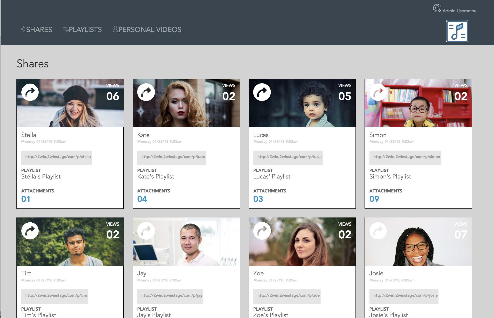

Static Comp 2

The objective is to build something that respects the integrity of the original design. 
My creative license includes:
Copy
Images
Icons
Color palette, but ONLY if it's a complementary palette.

Requirements
Basic static site setup with index.html and styles.css
Site must be responsive
Site must work across Firefox, Safari, Chrome
Developer must use normalize instead of reset file in CSS

<h1>Static Comp 2 original</h1>

<h1>My Static Comp 2</h1>
